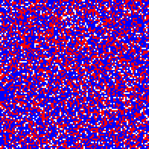

# Schelling's Model of Segregation

see: [Micromotives and Macrobehavior](https://www.amazon.com.au/Micromotives-Macrobehavior-Thomas-C-Schelling/dp/0393329461)

### 🚧 Work in Progress

In a 2D grid, each cell is either red, blue, or white (unoccupied).
An agent is unsatisfied if the ratio of its neighbours with the same color
is less than or equal to a threshold. An unsatisfied agent will move
to a more desirable cell.

